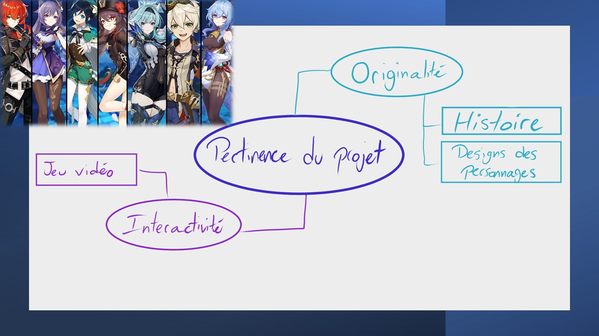

# Cours 11
## Plan de présentation 2 
Durée: 5 à 7 minutes

### Présentation
- Jeu d'action RPG
- Monde ouvert
- Histoire
- Méchaniques du jeu
- Compagnie

### Carte heuristique

### Technologies
- Unity

### Analyse critique
- Histoire originale
- Design des personnages
- Intéractif
- Point fort: Graphiques
- Point faible: Système Gacha
