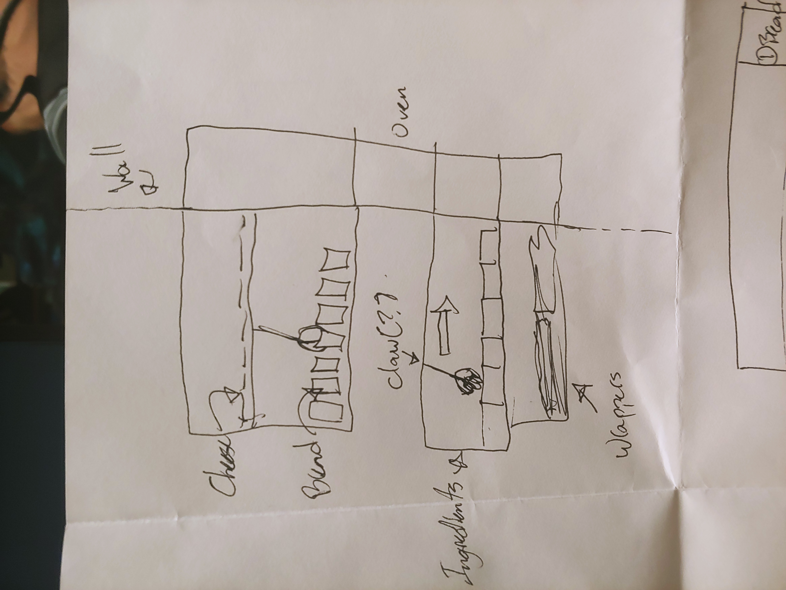

# Cours 13
## Préparation de la présentation 3 
Joindre des images de votre tempête d'idée et des esquisses de votre projet. Expliquer en 2 à 3 lignes votre projet. 

Notre projet s'agit d'un distributeur automatique pour les sandwich de Subway. Notre projet pourrair faciliter la production des sandwich et on aura besoin de moins d'employés à la fois.
