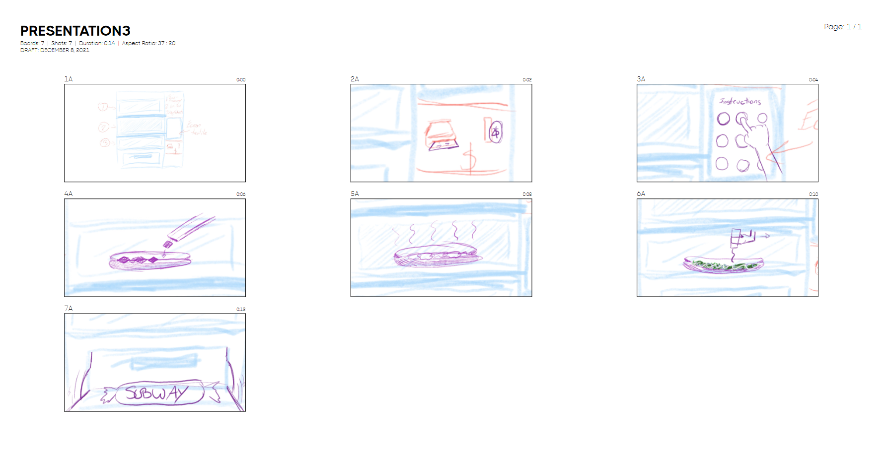

# Cours 14
## Plan de la présentation 3
Durée: 8 à 10 minutes

### Résumer votre projet en une phrase
Toujours frais, toujours prêt

### Description du projet 
- Distributeur automatique
- Payement cash ou carte
- Imgrédients à volonté

### Schéma du projet ou scénarimage

### Moodboard

### Technologies
- Programmeur
- Ingénieur
- Designer
- Développeur de logiciel
- Producteur
- Directeur de finances
- Marketing
- Manager des multimédias
- Animateur 2D
- Gestionnaire de projet

### Étapes de réalisation
Évaluation, Concept, Maquette, Production, Opération
